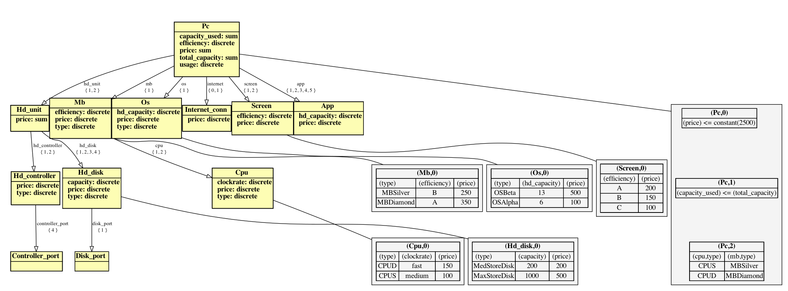

### PC

Product configuration example of a PC taken from [[1]](#1).

To get all stable models
```
clingo encoding.lp examples/pc/model.lp --opt-mode=enum 0
```




## References
<a id="1">[1]</a>
A.Felfernig et al. (2014).
Knowledge-Based Configuration: From Research to Business Cases.
Elsevier/Morgan Kaufmann.
doi:10.1016/C2011-0-69705-4.
